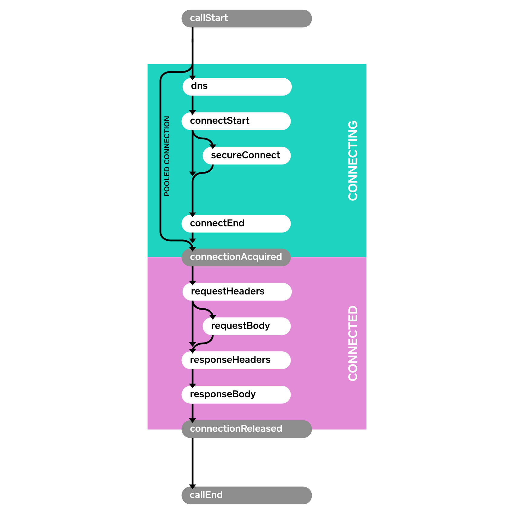
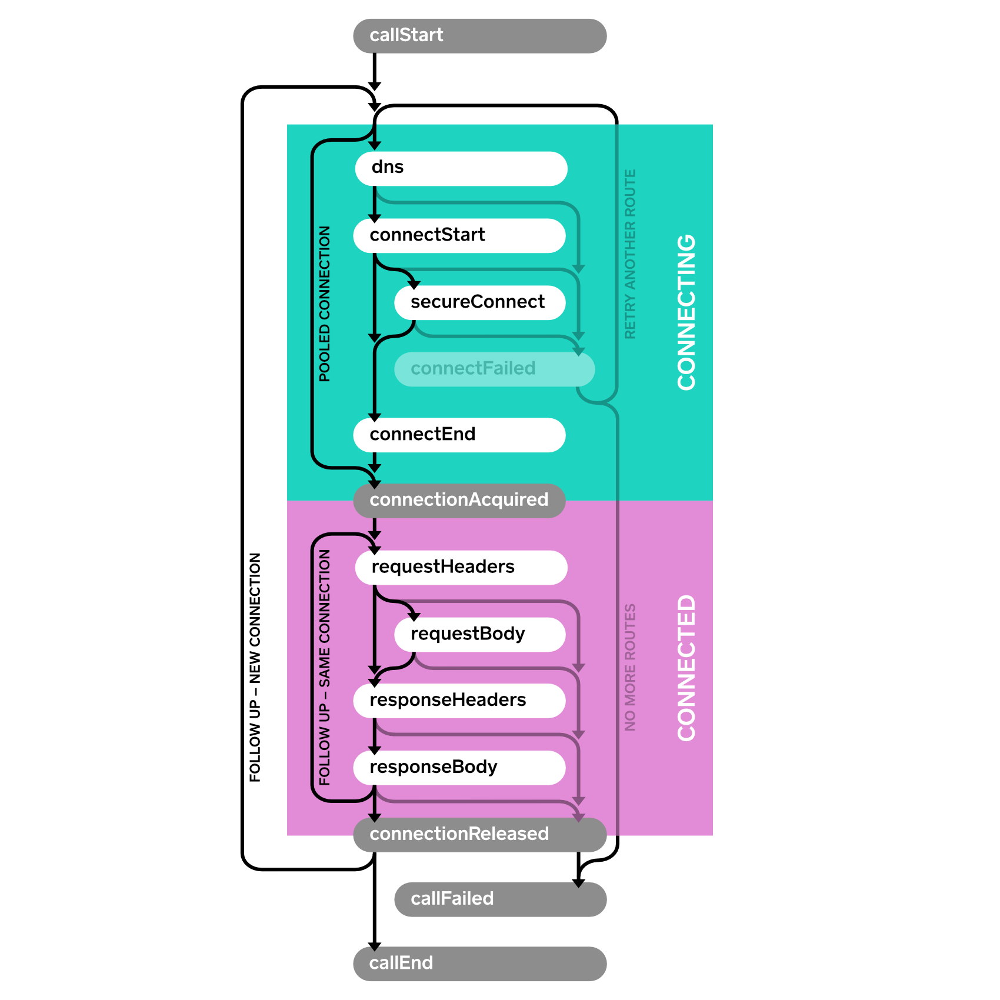

Events
======

Events allow you to capture metrics on your application’s HTTP calls. Use events to monitor:

 * The size and frequency of the HTTP calls your application makes. If you’re making too many calls, or your calls are too large, you should know about it!
 * The performance of these calls on the underlying network. If the network’s performance isn’t sufficient, you need to either improve the network or use less of it.

### EventListener

Subclass [EventListener](https://square.github.io/okhttp/3.x/okhttp/okhttp3/EventListener.html) and override methods for the events you are interested in. In a successful HTTP call with no redirects or retries the sequence of events is described by this flow.



Here’s a [sample event listener](https://github.com/square/okhttp/blob/master/samples/guide/src/main/java/okhttp3/recipes/PrintEventsNonConcurrent.java) that prints each event with a timestamp.

```java
class PrintingEventListener extends EventListener {
  private long callStartNanos;

  private void printEvent(String name) {
    long nowNanos = System.nanoTime();
    if (name.equals("callStart")) {
      callStartNanos = nowNanos;
    }
    long elapsedNanos = nowNanos - callStartNanos;
    System.out.printf("%.3f %s%n", elapsedNanos / 1000000000d, name);
  }

  @Override public void callStart(Call call) {
    printEvent("callStart");
  }

  @Override public void callEnd(Call call) {
    printEvent("callEnd");
  }

  @Override public void dnsStart(Call call, String domainName) {
    printEvent("dnsStart");
  }

  @Override public void dnsEnd(Call call, String domainName, List<InetAddress> inetAddressList) {
    printEvent("dnsEnd");
  }

  ...
}
```

We make a couple calls:

```java
Request request = new Request.Builder()
    .url("https://publicobject.com/helloworld.txt")
    .build();

System.out.println("REQUEST 1 (new connection)");
try (Response response = client.newCall(request).execute()) {
  // Consume and discard the response body.
  response.body().source().readByteString();
}

System.out.println("REQUEST 2 (pooled connection)");
try (Response response = client.newCall(request).execute()) {
  // Consume and discard the response body.
  response.body().source().readByteString();
}
```

And the listener prints the corresponding events:

```
REQUEST 1 (new connection)
0.000 callStart
0.010 dnsStart
0.017 dnsEnd
0.025 connectStart
0.117 secureConnectStart
0.586 secureConnectEnd
0.586 connectEnd
0.587 connectionAcquired
0.588 requestHeadersStart
0.590 requestHeadersEnd
0.591 responseHeadersStart
0.675 responseHeadersEnd
0.676 responseBodyStart
0.679 responseBodyEnd
0.679 connectionReleased
0.680 callEnd
REQUEST 2 (pooled connection)
0.000 callStart
0.001 connectionAcquired
0.001 requestHeadersStart
0.001 requestHeadersEnd
0.002 responseHeadersStart
0.082 responseHeadersEnd
0.082 responseBodyStart
0.082 responseBodyEnd
0.083 connectionReleased
0.083 callEnd
```

Notice how no connect events are fired for the second call. It reused the connection from the first request for dramatically better performance.

### EventListener.Factory

In the preceding example we used a field, `callStartNanos`, to track the elapsed time of each event. This is handy, but it won’t work if multiple calls are executing concurrently. To accommodate this, use a `Factory` to create a new `EventListener` instance for each `Call`. This allows each listener to keep call-specific state.

This [sample factory](https://github.com/square/okhttp/blob/master/samples/guide/src/main/java/okhttp3/recipes/PrintEvents.java) creates a unique ID for each call and uses that ID to differentiate calls in log messages.

```java
class PrintingEventListener extends EventListener {
  public static final Factory FACTORY = new Factory() {
    final AtomicLong nextCallId = new AtomicLong(1L);

    @Override public EventListener create(Call call) {
      long callId = nextCallId.getAndIncrement();
      System.out.printf("%04d %s%n", callId, call.request().url());
      return new PrintingEventListener(callId, System.nanoTime());
    }
  };

  final long callId;
  final long callStartNanos;

  public PrintingEventListener(long callId, long callStartNanos) {
    this.callId = callId;
    this.callStartNanos = callStartNanos;
  }

  private void printEvent(String name) {
    long elapsedNanos = System.nanoTime() - callStartNanos;
    System.out.printf("%04d %.3f %s%n", callId, elapsedNanos / 1000000000d, name);
  }

  @Override public void callStart(Call call) {
    printEvent("callStart");
  }

  @Override public void callEnd(Call call) {
    printEvent("callEnd");
  }

  ...
}
```

We can use this listener to race a pair of concurrent HTTP requests:

```java
Request washingtonPostRequest = new Request.Builder()
    .url("https://www.washingtonpost.com/")
    .build();
client.newCall(washingtonPostRequest).enqueue(new Callback() {
  ...
});

Request newYorkTimesRequest = new Request.Builder()
    .url("https://www.nytimes.com/")
    .build();
client.newCall(newYorkTimesRequest).enqueue(new Callback() {
  ...
});
```

Running this race over home WiFi shows the Times (`0002`) completes just slightly sooner than the Post (`0001`):

```
0001 https://www.washingtonpost.com/
0001 0.000 callStart
0002 https://www.nytimes.com/
0002 0.000 callStart
0002 0.010 dnsStart
0001 0.013 dnsStart
0001 0.022 dnsEnd
0002 0.019 dnsEnd
0001 0.028 connectStart
0002 0.025 connectStart
0002 0.072 secureConnectStart
0001 0.075 secureConnectStart
0001 0.386 secureConnectEnd
0002 0.390 secureConnectEnd
0002 0.400 connectEnd
0001 0.403 connectEnd
0002 0.401 connectionAcquired
0001 0.404 connectionAcquired
0001 0.406 requestHeadersStart
0002 0.403 requestHeadersStart
0001 0.414 requestHeadersEnd
0002 0.411 requestHeadersEnd
0002 0.412 responseHeadersStart
0001 0.415 responseHeadersStart
0002 0.474 responseHeadersEnd
0002 0.475 responseBodyStart
0001 0.554 responseHeadersEnd
0001 0.555 responseBodyStart
0002 0.554 responseBodyEnd
0002 0.554 connectionReleased
0002 0.554 callEnd
0001 0.624 responseBodyEnd
0001 0.624 connectionReleased
0001 0.624 callEnd
```

The `EventListener.Factory` also makes it possible to limit metrics to a subset of calls. This one captures metrics on a random 10%:

```java
class MetricsEventListener extends EventListener {
  private static final Factory FACTORY = new Factory() {
    @Override public EventListener create(Call call) {
      if (Math.random() < 0.10) {
        return new MetricsEventListener(call);
      } else {
        return EventListener.NONE;
      }
    }
  };

  ...
}
```

### Events with Failures

When an operation fails, a failure method is called. This is `connectFailed()` for failures while building a connection to the server, and `callFailed()` when the HTTP call fails permanently. When a failure happens it is possible that a `start` event won’t have a corresponding `end` event.


### Events with Retries and Follow-Ups

OkHttp is resilient and can automatically recover from some connectivity failures. In this case, the `connectFailed()` event is not terminal and not followed by `callFailed()`. Event listeners will receive multiple events of the same type when retries are attempted.

A single HTTP call may require follow-up requests to be made to handle authentication challenges, redirects, and HTTP-layer timeouts. In such cases multiple connections, requests, and responses may be attempted. Follow-ups are another reason a single call may trigger multiple events of the same type.



### Availability

Events is available as a public API in OkHttp 3.11. Future releases may introduce new event types; you will need to override the corresponding methods to handle them.
