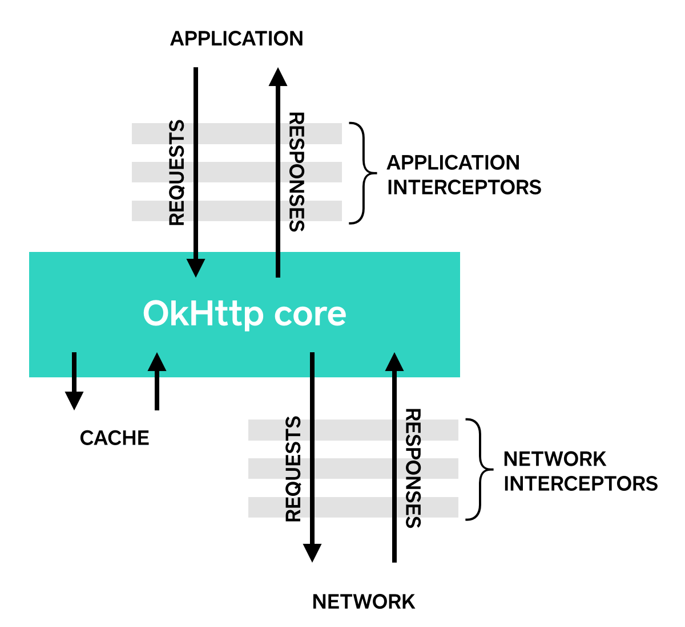

Interceptors
============

Interceptors are a powerful mechanism that can monitor, rewrite, and retry calls. Here's a simple interceptor that logs the outgoing request and the incoming response.

```java
class LoggingInterceptor implements Interceptor {
  @Override public Response intercept(Interceptor.Chain chain) throws IOException {
    Request request = chain.request();

    long t1 = System.nanoTime();
    logger.info(String.format("Sending request %s on %s%n%s",
        request.url(), chain.connection(), request.headers()));

    Response response = chain.proceed(request);

    long t2 = System.nanoTime();
    logger.info(String.format("Received response for %s in %.1fms%n%s",
        response.request().url(), (t2 - t1) / 1e6d, response.headers()));

    return response;
  }
}
```

A call to `chain.proceed(request)` is a critical part of each interceptor’s implementation. This simple-looking method is where all the HTTP work happens, producing a response to satisfy the request. If `chain.proceed(request)` is being called more than once previous response bodies must be closed.

Interceptors can be chained. Suppose you have both a compressing interceptor and a checksumming interceptor: you'll need to decide whether data is compressed and then checksummed, or checksummed and then compressed. OkHttp uses lists to track interceptors, and interceptors are called in order.



### Application Interceptors

Interceptors are registered as either _application_ or _network_ interceptors. We'll use the `LoggingInterceptor` defined above to show the difference.

Register an _application_ interceptor by calling `addInterceptor()` on `OkHttpClient.Builder`:

```java
OkHttpClient client = new OkHttpClient.Builder()
    .addInterceptor(new LoggingInterceptor())
    .build();

Request request = new Request.Builder()
    .url("http://www.publicobject.com/helloworld.txt")
    .header("User-Agent", "OkHttp Example")
    .build();

Response response = client.newCall(request).execute();
response.body().close();
```

The URL `http://www.publicobject.com/helloworld.txt` redirects to `https://publicobject.com/helloworld.txt`, and OkHttp follows this redirect automatically. Our application interceptor is called **once** and the response returned from `chain.proceed()` has the redirected response:

```
INFO: Sending request http://www.publicobject.com/helloworld.txt on null
User-Agent: OkHttp Example

INFO: Received response for https://publicobject.com/helloworld.txt in 1179.7ms
Server: nginx/1.4.6 (Ubuntu)
Content-Type: text/plain
Content-Length: 1759
Connection: keep-alive
```

We can see that we were redirected because `response.request().url()` is different from `request.url()`. The two log statements log two different URLs.

### Network Interceptors

Registering a network interceptor is quite similar. Call `addNetworkInterceptor()` instead of `addInterceptor()`:

```java
OkHttpClient client = new OkHttpClient.Builder()
    .addNetworkInterceptor(new LoggingInterceptor())
    .build();

Request request = new Request.Builder()
    .url("http://www.publicobject.com/helloworld.txt")
    .header("User-Agent", "OkHttp Example")
    .build();

Response response = client.newCall(request).execute();
response.body().close();
```

When we run this code, the interceptor runs twice. Once for the initial request to `http://www.publicobject.com/helloworld.txt`, and another for the redirect to `https://publicobject.com/helloworld.txt`.

```
INFO: Sending request http://www.publicobject.com/helloworld.txt on Connection{www.publicobject.com:80, proxy=DIRECT hostAddress=54.187.32.157 cipherSuite=none protocol=http/1.1}
User-Agent: OkHttp Example
Host: www.publicobject.com
Connection: Keep-Alive
Accept-Encoding: gzip

INFO: Received response for http://www.publicobject.com/helloworld.txt in 115.6ms
Server: nginx/1.4.6 (Ubuntu)
Content-Type: text/html
Content-Length: 193
Connection: keep-alive
Location: https://publicobject.com/helloworld.txt

INFO: Sending request https://publicobject.com/helloworld.txt on Connection{publicobject.com:443, proxy=DIRECT hostAddress=54.187.32.157 cipherSuite=TLS_ECDHE_RSA_WITH_AES_256_CBC_SHA protocol=http/1.1}
User-Agent: OkHttp Example
Host: publicobject.com
Connection: Keep-Alive
Accept-Encoding: gzip

INFO: Received response for https://publicobject.com/helloworld.txt in 80.9ms
Server: nginx/1.4.6 (Ubuntu)
Content-Type: text/plain
Content-Length: 1759
Connection: keep-alive
```

The network requests also contain more data, such as the `Accept-Encoding: gzip` header added by OkHttp to advertise support for response compression. The network interceptor's `Chain` has a non-null `Connection` that can be used to interrogate the IP address and TLS configuration that were used to connect to the webserver.

### Choosing between application and network interceptors

Each interceptor chain has relative merits.

**Application interceptors**

 * Don't need to worry about intermediate responses like redirects and retries.
 * Are always invoked once, even if the HTTP response is served from the cache.
 * Observe the application's original intent. Unconcerned with OkHttp-injected headers like `If-None-Match`.
 * Permitted to short-circuit and not call `Chain.proceed()`.
 * Permitted to retry and make multiple calls to `Chain.proceed()`.

**Network Interceptors**

 * Able to operate on intermediate responses like redirects and retries.
 * Not invoked for cached responses that short-circuit the network.
 * Observe the data just as it will be transmitted over the network.
 * Access to the `Connection` that carries the request.

### Rewriting Requests

Interceptors can add, remove, or replace request headers. They can also transform the body of those requests that have one. For example, you can use an application interceptor to add request body compression if you're connecting to a webserver known to support it.

```java
/** This interceptor compresses the HTTP request body. Many webservers can't handle this! */
final class GzipRequestInterceptor implements Interceptor {
  @Override public Response intercept(Interceptor.Chain chain) throws IOException {
    Request originalRequest = chain.request();
    if (originalRequest.body() == null || originalRequest.header("Content-Encoding") != null) {
      return chain.proceed(originalRequest);
    }

    Request compressedRequest = originalRequest.newBuilder()
        .header("Content-Encoding", "gzip")
        .method(originalRequest.method(), gzip(originalRequest.body()))
        .build();
    return chain.proceed(compressedRequest);
  }

  private RequestBody gzip(final RequestBody body) {
    return new RequestBody() {
      @Override public MediaType contentType() {
        return body.contentType();
      }

      @Override public long contentLength() {
        return -1; // We don't know the compressed length in advance!
      }

      @Override public void writeTo(BufferedSink sink) throws IOException {
        BufferedSink gzipSink = Okio.buffer(new GzipSink(sink));
        body.writeTo(gzipSink);
        gzipSink.close();
      }
    };
  }
}
```

### Rewriting Responses

Symmetrically, interceptors can rewrite response headers and transform the response body. This is generally more dangerous than rewriting request headers because it may violate the webserver's expectations!

If you're in a tricky situation and prepared to deal with the consequences, rewriting response headers is a powerful way to work around problems. For example, you can fix a server's misconfigured `Cache-Control` response header to enable better response caching:

```java
/** Dangerous interceptor that rewrites the server's cache-control header. */
private static final Interceptor REWRITE_CACHE_CONTROL_INTERCEPTOR = new Interceptor() {
  @Override public Response intercept(Interceptor.Chain chain) throws IOException {
    Response originalResponse = chain.proceed(chain.request());
    return originalResponse.newBuilder()
        .header("Cache-Control", "max-age=60")
        .build();
  }
};
```

Typically this approach works best when it complements a corresponding fix on the webserver!
