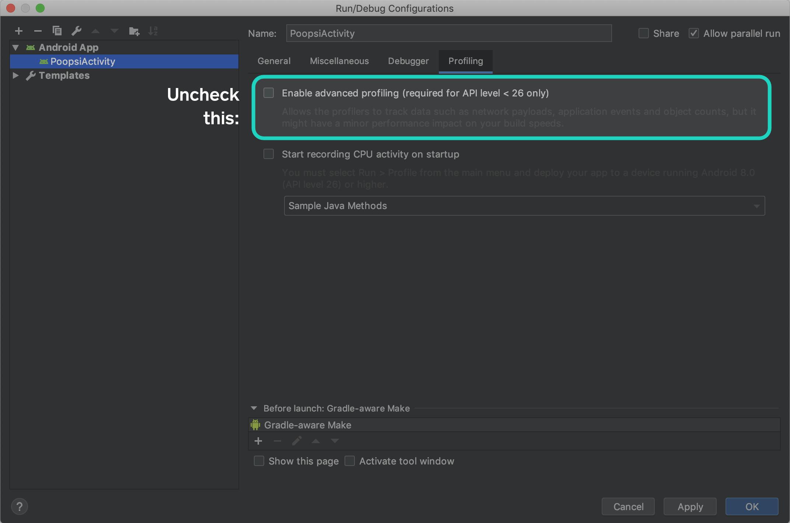

Upgrading to OkHttp 4
=====================

OkHttp 4.x upgrades our implementation language from Java to Kotlin and keeps everything else the
same. We’ve chosen Kotlin because it gives us powerful new capabilities while integrating closely
with Java.

We spent a lot of time and energy on retaining strict compatibility with OkHttp 3.x. We’re even
keeping the package name the same: `okhttp3`!

There are three kinds of compatibility we’re tracking:

 * **Binary compatibility** is the ability to compile a program against OkHttp 3.x, and then to run
   it against OkHttp 4.x. We’re using the excellent [japicmp][japicmp] library via its
   [Gradle plugin][japicmp_gradle] to enforce binary compatibility.

 * **Java source compatibility** is the ability to upgrade Java uses of OkHttp 3.x to 4.x without
   changing `.java` files.

 * **Kotlin source compatibility** is the ability to upgrade Kotlin uses of OkHttp 3.x to 4.x
   without changing `.kt` files.

With a few small exceptions (below), OkHttp 4.x is both binary- and Java source-compatible with
OkHttp 3.x. You can use an OkHttp 4.x .jar file with applications or libraries built for OkHttp 3.x.

OkHttp is **not** source-compatible for Kotlin callers, but upgrading should be automatic thanks to
Kotlin’s powerful deprecation features. Most developers should be able to use IntelliJ’s _Code
Cleanup_ for a safe and fast upgrade.


Backwards-Incompatible Changes
------------------------------

#### OkHttpClient final methods

`OkHttpClient` has 26 accessors like `interceptors()` and `writeTimeoutMillis()` that were non-final
in OkHttp 3.x and are final in 4.x. These were made non-final for use with mocking frameworks like
[Mockito][mockito]. We believe subtyping `OkHttpClient` is the wrong way to test with OkHttp. If
you must, mock `Call.Factory` which is the interface that `OkHttpClient` implements.

#### Internal API changes

The `okhttp3.internal` package is not a published API and we change it frequently without warning.
Depending on code in this package is bad and will cause you problems with any upgrade! But the 4.x
will be particularly painful to naughty developers that import from this package! We changed a lot
to take advantage of sweet Kotlin features.

#### Credentials.basic()

The username and password parameters to `Credentials.basic()` are now non-null strings. In OkHttp
3.x, null would yield a username or password of "null".

#### HttpUrl.queryParameterValues()

The return type of `HttpUrl.queryParameterValues()` is `List<String?>`. Lists that may contain null
are uncommon and Kotlin callers may have incorrectly assigned the result to `List<String>`.


Code Cleanup
------------

IntelliJ and Android Studio offer a **Code Cleanup** feature that will automatically update
deprecated APIs with their replacements. Access this feature from the _Search Anywhere_ dialog
(double-press shift) or under the _Analyze_ menu.

We’ve included deprecated APIs in OkHttp 4.0 because they make migration easy. We will remove them
in a future release! If you’re skipping releases, it’ll be much easier if you upgrade to OkHttp 4.0
as an intermediate step.

#### Vars and Vals

Java doesn’t have language support for properties so developers make do with getters and setters.
Kotlin does have properties and we take advantage of them in OkHttp.

 * **Address**: certificatePinner, connectionSpecs, dns, hostnameVerifier, protocols, proxy,
   proxyAuthenticator, proxySelector, socketFactory, sslSocketFactory, url
 * **Cache**: directory
 * **CacheControl**: immutable, maxAgeSeconds, maxStaleSeconds, minFreshSeconds, mustRevalidate,
   noCache, noStore, noTransform, onlyIfCached, sMaxAgeSeconds
 * **Challenge**: authParams, charset, realm, scheme
 * **CipherSuite**: javaName
 * **ConnectionSpec**: cipherSuites, supportsTlsExtensions, tlsVersions
 * **Cookie**: domain, expiresAt, hostOnly, httpOnly, name, path, persistent, value
 * **Dispatcher**: executorService
 * **FormBody**: size
 * **Handshake**: cipherSuite, localCertificates, localPrincipal, peerCertificates, peerPrincipal,
   tlsVersion
 * **HandshakeCertificates**: keyManager, trustManager
 * **Headers**: size
 * **HeldCertificate**: certificate, keyPair
 * **HttpLoggingInterceptor**: level
 * **HttpUrl**: encodedFragment, encodedPassword, encodedPath, encodedPathSegments, encodedQuery,
   encodedUsername, fragment, host, password, pathSegments, pathSize, port, query,
   queryParameterNames, querySize, scheme, username
 * **MockResponse**: headers, http2ErrorCode, socketPolicy, status, trailers
 * **MockWebServer**: bodyLimit, port, protocolNegotiationEnabled, protocols, requestCount,
   serverSocketFactory
 * **MultipartBody.Part**: body, headers
 * **MultipartBody.**: boundary, parts, size, type
 * **OkHttpClient**: authenticator, cache, callTimeoutMillis, certificatePinner,
   connectTimeoutMillis, connectionPool, connectionSpecs, cookieJar, dispatcher, dns,
   eventListenerFactory, followRedirects, followSslRedirects, hostnameVerifier, interceptors,
   networkInterceptors, pingIntervalMillis, protocols, proxy, proxyAuthenticator, proxySelector,
   readTimeoutMillis, retryOnConnectionFailure, socketFactory, sslSocketFactory, writeTimeoutMillis
 * **PushPromise**: headers, method, path, response
 * **Request**: body, cacheControl, headers, method, url
 * **Response**: body, cacheControl, cacheResponse, code, handshake, headers, message,
   networkResponse, priorResponse, protocol, receivedResponseAtMillis, request, sentRequestAtMillis
 * **Route**: address, proxy, socketAddress
 * **TlsVersion**: javaName

#### Renamed Functions

* **Headers.of()**: for symmetry with `listOf()`, `setOf()`, etc., we’ve replaced
  `Headers.of(String...)` with `headersOf(vararg String)`.

#### Extension Functions

We’ve migrated from static functions to extension functions where we think they fit.

| Java                                | Kotlin                          |
| :---------------------------------- | :------------------------------ |
| Handshake.get(SSLSession)           | SSLSession.handshake()          |
| Headers.of(Map<String, String>)     | Map<String, String>.toHeaders() |
| HttpUrl.get(String)                 | String.toHttpUrl()              |
| HttpUrl.get(URI)                    | URI.toHttpUrlOrNull()           |
| HttpUrl.get(URL)                    | URL.toHttpUrlOrNull()           |
| HttpUrl.parse(String)               | String.toHttpUrlOrNull()        |
| HttpUrl.uri()                       | HttpUrl.toUri()                 |
| HttpUrl.url()                       | HttpUrl.toUrl()                 |
| MediaType.get(String)               | String.toMediaType()            |
| MediaType.parse(String)             | String.toMediaTypeOrNull()      |
| RequestBody.create(ByteArray)       | ByteArray.toRequestBody()       |
| RequestBody.create(ByteString)      | ByteString.toRequestBody()      |
| RequestBody.create(File)            | File.asRequestBody()            |
| RequestBody.create(String)          | String.toRequestBody()          |
| ResponseBody.create(BufferedSource) | BufferedSource.asResponseBody() |
| ResponseBody.create(ByteArray)      | ByteArray.toResponseBody()      |
| ResponseBody.create(ByteString)     | ByteString.toResponseBody()     |
| ResponseBody.create(String)         | String.toResponseBody()         |


SAM Conversions
---------------

When you use Java APIs from Kotlin you can operate on Java interfaces as if they were Kotlin
lambdas. The [feature][java_sams] is available for interfaces that define a Single Abstract Method
(SAM).

But when you use Kotlin APIs from Kotlin there’s no automatic conversion. Code that used SAM lambdas
with OkHttp 3.x: must use `object :` with OkHttp 4.x:

Kotlin calling OkHttp 3.x:

```kotlin
val client = OkHttpClient.Builder()
    .dns { hostname -> InetAddress.getAllByName(hostname).toList() }
    .build()
```

Kotlin calling OkHttp 4.x:

```kotlin
val client = OkHttpClient.Builder()
    .dns(object : Dns {
      override fun lookup(hostname: String) =
          InetAddress.getAllByName(hostname).toList()
    })
    .build()
```

SAM conversion impacts these APIs:

 * Authenticator
 * Dispatcher.setIdleCallback(Runnable)
 * Dns
 * EventListener.Factory
 * HttpLoggingInterceptor.Logger
 * LoggingEventListener.Factory
 * OkHttpClient.Builder.hostnameVerifier(HostnameVerifier)

JetBrains [is working on][kotlin_sams] SAM conversions of Kotlin interfaces. Expect it in a future
release of the Kotlin language.


Companion Imports
-----------------

The equivalent of static methods in Java is companion object functions in Kotlin. The bytecode is
the same but `.kt` files now need `Companion` in the import.

This works with OkHttp 3.x:

```kotlin
import okhttp3.CipherSuite.forJavaName
```

But OkHttp 4.x needs a `Companion`:

```kotlin
import okhttp3.CipherSuite.Companion.forJavaName
```

In the unlikely event that you have a lot of these, run this:

```bash
sed -i "" \
  's/^\(import okhttp3\.[^.]*\)\.\([a-z][a-zA-Z]*\)$/\1.Companion.\2/g' \
  `find . -name "*.kt"`
```


Advanced Profiling
------------------

Android Studio’s Advanced Profiling feature rewrites OkHttp bytecode for instrumentation.
Unfortunately it crashes on OkHttp 4.x’s bytecode. Until [Google’s bug][advanced_profiling_bug] is
fixed you must disable advanced profiling in Android Studio.




R8 / ProGuard
-------------

R8 and ProGuard are both code optimizers for `.class` files.

R8 is the [default optimizer][r8] in Android Studio 3.4 and newer. It works well with all
releases of OkHttp.

ProGuard was the previous default. We’re [tracking problems][proguard_problems] with interactions
between ProGuard, OkHttp 4.x, and Kotlin-originated `.class` files. Make sure you’re on the latest
release if you’re using ProGuard,


Gradle
------

OkHttp 4’s minimum requirements are Java 8+ and Android 5+. These requirements were
[first introduced][require_android_5] with OkHttp 3.13.

Here’s what you need in `build.gradle` to target Java 8 byte code for Kotlin, Java, and Android
plugins respectively.

```
compileKotlin {
  kotlinOptions {
    jvmTarget = "1.8"
  }
}
compileTestKotlin {
  kotlinOptions {
    jvmTarget = "1.8"
  }
}

compileJava {
  sourceCompatibility = JavaVersion.VERSION_1_8
  targetCompatibility = JavaVersion.VERSION_1_8
}

android {
  compileOptions {
    sourceCompatibility JavaVersion.VERSION_1_8
    targetCompatibility JavaVersion.VERSION_1_8
  }
}
```


 [advanced_profiling_bug]: https://issuetracker.google.com/issues/135141615
 [japicmp]: https://github.com/siom79/japicmp
 [japicmp_gradle]: https://github.com/melix/japicmp-gradle-plugin
 [java_sams]: https://kotlinlang.org/docs/reference/java-interop.html#sam-conversions
 [kotlin_sams]: https://youtrack.jetbrains.com/issue/KT-11129
 [mockito]: https://site.mockito.org/
 [proguard_problems]: https://github.com/square/okhttp/issues/5167
 [require_android_5]: https://cashapp.github.io/2019-02-05/okhttp-3-13-requires-android-5
 [r8]: https://developer.android.com/studio/releases#r8-default
